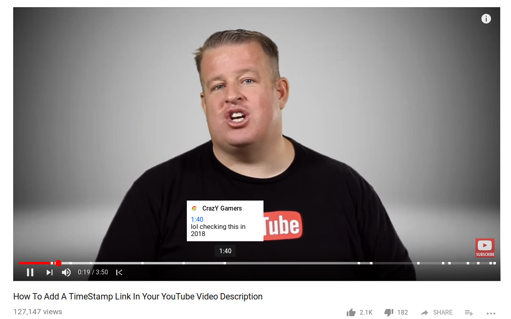

# YouTube Timestamps
Web extension that shows timestamps from comments on timeline. Available for [Chrome](https://chrome.google.com/webstore/detail/youtube-timestamps/fjchmkcdmgeimkholkgodkejnikeklmh) and [Firefox](https://addons.mozilla.org/en-US/firefox/addon/youtube-timestamps/).

# Other web extensions
[YouTube Chapters in Player](https://github.com/ris58h/youtube-chapters-in-player) - shows YouTube chapters right in the player. Available for [Chrome](https://chrome.google.com/webstore/detail/youtube-chapters-in-playe/ikalbbakholajifblhnmbcffhmhnnohl) and [Firefox](https://addons.mozilla.org/en-US/firefox/addon/youtube-chapters-in-player/).